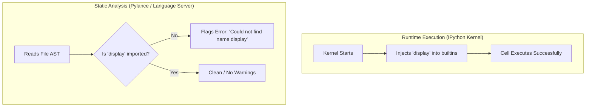

# In-Depth Guide: Resolving `Could not find name 'display'` in VS Code Jupyter Notebooks

## 1. Executive Summary & Problem Overview

When writing Python code inside Jupyter Notebooks (`.ipynb`) within Visual Studio Code or Antigravity IDE, you may encounter a static linting/type-checking warning:

```text
Could not find name 'display' @[vscode-notebook-cell:...]
```
*(Diagnostics Code: `reportUndefinedVariable`)*

This guide provides a comprehensive technical breakdown of why this occurs, how the IPython runtime differs from static analysis tools, and the recommended solutions with complete code snippets.

---

## 2. Root Cause Analysis

### 2.1 Dynamic Runtime (IPython Kernel) vs. Static Analysis (Pylance/Pyright)

To understand this issue, it helps to distinguish between how the code is **executed** versus how it is **analyzed**:



1. **At Runtime (IPython Kernel):**
   - When a Jupyter kernel starts, it automatically injects several interactive helper functions into the Python `builtins` namespace.
   - Functions like `display()`, `get_ipython()`, and `%` magic commands are globally accessible at runtime without explicit imports.

2. **At Static Analysis Time (Pylance / Pyright in VS Code):**
   - The Language Server analyzes your code statically (reading the syntax tree without running the kernel).
   - Standard Python built-ins (like `print()`, `len()`, `range()`) exist in standard Python's `builtins.pyi` type stubs.
   - Because `display()` is an IPython-specific runtime extension and was not explicitly imported, Pylance treats it as an undefined symbol and highlights it with a warning.

---

## 3. Resolution Strategies

### Method 1: Explicit Import from `IPython.display` (Recommended)

The most robust and industry-standard solution is to explicitly import `display`. This satisfies static type checkers, linters, and CI/CD pipelines while preserving the rich HTML table output.

#### Top of Notebook Import Cell:
```python
# Standard library and third-party imports
import numpy as np
import pandas as pd
import matplotlib.pyplot as plt
import seaborn as sns
import missingno as msno

# Explicitly import display for static analysis compliance
from IPython.display import display
```

#### In Your Analysis Cell:
```python
# Location columns visualization and summary
cleaned_data[location_columns].plot(kind="box")
plt.xticks(rotation=45)

# 'display' is now recognized both statically and dynamically
display(cleaned_data[location_columns].describe())
```

---

### Method 2: Separating Plotting and Automatic Display

Jupyter automatically renders the value of the **last expression** in a code cell as rich HTML. If you explicitly close/render the plot with `plt.show()`, the subsequent expression will be displayed without calling `display()`.

```python
# 1. Generate and render the plot
cleaned_data[location_columns].plot(kind="box")
plt.xticks(rotation=45)
plt.show()

# 2. Last expression is automatically displayed as formatted HTML table
cleaned_data[location_columns].describe()
```

---

### Method 3: Rendering via Standard Output (`print`)

If formatted HTML table rendering is not required and plain-text output is sufficient:

```python
cleaned_data[location_columns].plot(kind="box")
plt.xticks(rotation=45)

# Outputs summary statistics as plain formatted text
print(cleaned_data[location_columns].describe())
```

*Comparison Note:*
- `display(df)`: Renders an interactive, scrollable HTML table with CSS formatting.
- `print(df)`: Renders ASCII-formatted text.

---

### Method 4: Advanced Multiple Object Display

When inspecting multiple dataframes or metadata objects in a single cell:

```python
from IPython.display import display, Markdown

# Display a markdown header followed by multiple data summaries
display(Markdown("### Summary Statistics for Location Features"))
display(cleaned_data[['Restaurant_latitude', 'Restaurant_longitude']].describe())

display(Markdown("### Missing Values Count"))
display(cleaned_data[location_columns].isna().sum())
```

---

## 4. Comparison Summary

| Approach | Linter Warning Resolved? | Rich HTML Table Rendering? | Best Use Case |
| :--- | :---: | :---: | :--- |
| **Explicit `from IPython.display import display`** | **Yes** | **Yes** | **Standard / Recommended for production & clean codebases** |
| **`plt.show()` + Final Expression** | **Yes** | **Yes** | Single DataFrame output per cell alongside plots |
| **`print(df)`** | **Yes** | No (Plain Text) | Terminal output / logging / quick CLI scripts |
| **Relying on implicit kernel global** | No | Yes | Quick scratchpad exploratory notebooks |

---

## 5. Verification Checklist

To verify the fix in [dataCleaning.ipynb](file:///c:/Users/ARYAN%20PRAJAPATI/OneDrive/Desktop/python/SwiggyTimeDelayPrediction/dataCleaning.ipynb):

1. Open the initial imports cell at the top of the notebook.
2. Ensure `from IPython.display import display` is present.
3. Run the import cell (`Shift + Enter`).
4. Navigate to the boxplot cell and verify that the yellow/red squiggly underline on `display` is gone.
